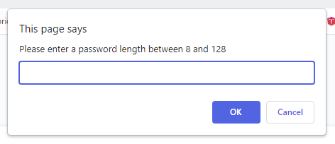

# password-generator

## Description

This is a password generator that ask the users a couple of questions to determine how to generate the password. It will ask the lengh of password wants to generated as well as if they want to include uppercase, lowercase, numbers and special chars in this password. After asking the questions it will then generate a password and display it in the box. If the user would like to generate a new password they can do so by clicking on the generate password button again. 

What I learned from this project is the usage of "if" and "while" statements to create conditionals. I also got to practice the use of objects and array lists by storing the different type of special characters into arrays. I also learned about forloops so I can reduce repetitive code. 

## Installation

N/A

## Usage

- open to the page
- click on generate password button
- enter a password length
- answer criteria questions by clicking ok for yes and cancel for no
- look in the box for your new password.
- if you user would like to generate a new password. click on generate password again. Repeat

[https://jjackielee.github.io/password-generator](https://jjackielee.github.io/password-generator)

## Credits

N/A

## License

N/A

---

## Features

When you click on the generate button it will prompt you a series of questions for you to answer so it can generate a password for you. 
